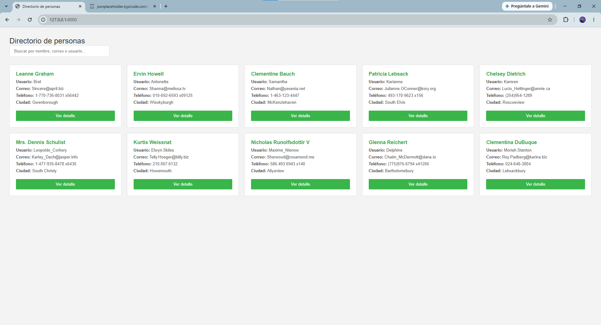
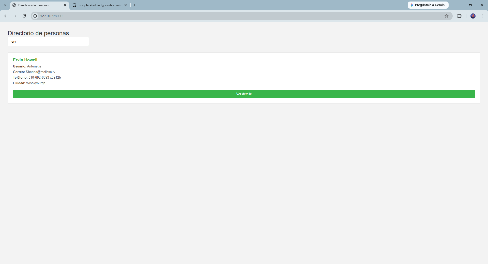
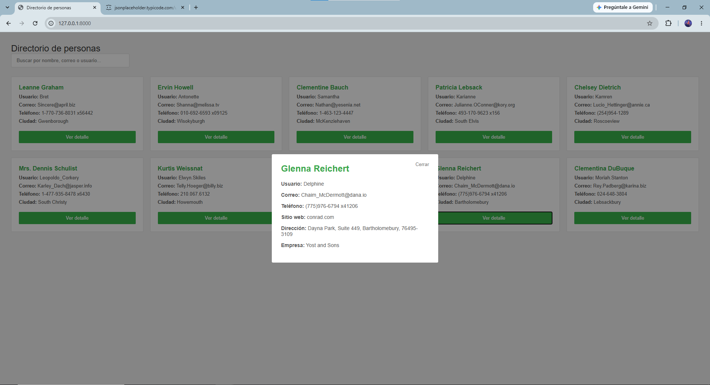

# Directorio de Personas

Aplicación web que permite consultar un directorio de personas obtenidas desde un servicio externo, mostrando su información principal en un listado, con búsqueda en tiempo real y detalle ampliado mediante una ventana modal. La interfaz es responsiva y contempla los distintos estados de carga (cargando, sin resultados, error).

## Vista previa
**Listado de personas**


**Búsqueda en tiempo real**


**Detalle en modal**



## Tecnologías utilizadas

- Python — lenguaje base del backend.
- Django — configura el proyecto, corre el servidor local y sirve la vista `index` con el HTML esqueleto (no consume la API).
- JavaScript — hace el consumo de la API (fetch) y toda la lógica de datos,
  dividido en dos archivos:
    - directorio.js: fetch al servicio, filtrado/búsqueda y renderizado (agrupados porque son funciones dependientes entre sí).
    - modal.js: solo imprime el detalle de la persona ya cargada en memoria, sin volver a golpear el servicio.
- HTML — estructura base de la página.
- CSS — estilos y diseño responsivo.
- Git — control de versiones con commits incrementales.

## Requisitos para ejecutarlo

- Python 3.13 (64 bits)
- Entorno virtual (venv) recomendado
- Dependencias listadas en `requirements.txt`:
    - Django==6.1
    - asgiref==3.12.1
    - certifi==2026.7.22
    - charset-normalizer==3.4.9
    - idna==3.18
    - requests==2.34.2
    - sqlparse==0.5.5
    - tzdata==2026.3
    - urllib3==2.7.0
- Navegador moderno con JavaScript habilitado (Chrome, Firefox, Edge),
  ya que el consumo de la API ocurre del lado del cliente.

## Instrucciones de instalación.

Clonar el repositorio
git clone <url-del-repositorio>
cd directorio-personas

Crear el entorno virtual
python -m venv venv

Activar el entorno virtual
# En Windows (PowerShell):
venv\Scripts\Activate.ps1
# En macOS/Linux:
source venv/bin/activate

Instalar las dependencias
pip install -r requirements.txt


## Comando para iniciar la aplicación.

python manage.py runserver

url:
http://127.0.0.1:8000/

## Estructura del proyecto
````
directorio-personas/
├── .gitignore
├── README.md
├── consultas.sql              # Consultas SQL Server del ejercicio complementario
├── manage.py
├── requirements.txt
│
├── directorio_personas/       # Configuración global del proyecto Django
│   ├── settings.py
│   ├── urls.py
│   └── ...
│
└── personas/                  # App principal
    ├── models.py
    ├── views.py                # vista index
    ├── urls.py                 # Ruta de la app
    ├── templates/personas/
    │   └── index.html          # Contenedor HTML donde JS inyecta los datos
    └── static/personas/
        ├── css/
        │   └── estilos.css     # Diseño
        └── js/
            ├── directorio.js   # Fetch a la API, filtrado y renderizado
            └── modal.js        # Muestra el detalle
````

## Cómo se consume el servicio web

El consumo del servicio se realiza desde JavaScript, del lado del cliente, mediante fetch. Django únicamente sirve la vista index con el HTML base — lo hice así para que el usuario nunca vea una página en blanco mientras se cargan los datos. Esta decisión evita recargas o redirecciones de página, haciendo que la búsqueda y el filtrado se sientan rapidos, y evita que Django actúe como intermediario entre el navegador y la API externa (me gusta más una petición directa, en vez de dos). Los datos obtenidos se guardan en memoria y se reutilizan tanto para el filtrado como para el detalle en modal, evitando peticiones repetidas al servicio por cada acción del usuario.

## Tiempo aproximado invertido

Se dedicaron aproximadamente 5 horas al ejercicio. Puse como prioridad entender bien cada decisión de arquitectura (consumo del servicio, estructura de archivos JS, relaciones para el ejercicio de SQL) antes de escribir código.

## Requerimientos no completados

Intente completar todos los requerimientos obligatorios: listado de personas,
búsqueda/filtro, detalle en modal, consumo del servicio, manejo de los
cuatro estados de interfaz (cargando, disponible, sin resultados, error)
y diseño responsivo.

El diseño responsivo se probó usando las herramientas de desarrollador
del navegador (modo dispositivo móvil, F12), pero no se probó en un
dispositivo físico real ni redimensionando manualmente la ventana en
escritorio.

## Mejoras futuras

- Mostraría la fotografía o avatar de cada persona en el listado y detalle.
- Probaría la responsividad directamente en dispositivos móviles y tablets reales, más allá de las DevTools del navegador.
- Revisaría el manejo de errores en casos adicionales no cubiertos.

## Herramientas de IA y otras herramientas utilizadas

Use claude para analizar los requerimientos del PDF, discutir y validar la estructura del proyecto (arquitectura Django vs. JavaScript para el consumo del servicio, cómo dividir directorio.js y modal.js) y para resolver funciones específicas del código JavaScript. Al trabajar en equipo generalmente consulto esto con un compañero, pero en este caso la ai fue minimamente funcional.

Trabaje primero el razonamiento propio relación entre las tablas Personas y Tickets, cuándo aplica JOIN vs. LEFT JOIN, y la ai me corrigio un detalle en una consulta en especifico.

Utilice notion para ir anotando ideas y decisiones mientras se definía la estructura del proyecto y el contenido de este README.
Para esquematizar ideas y como conocimiento personal de repaso a futuro.